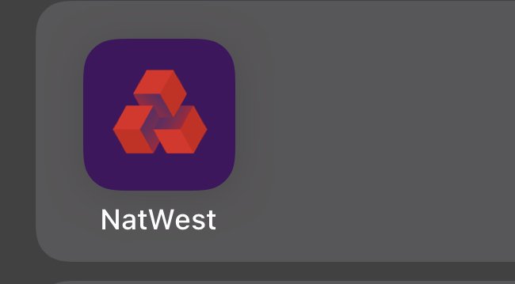
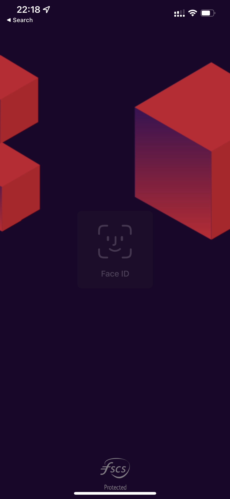

# PaymentApp

 Simple banking app

we are producing a tv series and require a banking type app cloned/created that represents a bank in the UK and we require the following:

- Same splash screen
- FaceID function
- Same Home Screen
- Ability to put the app into edit mode, where we can change the balances and sort code and account number and when we click on save it puts the app back into app mode
- Ability to add PAYEEs and import these contacts into the “make a payment” section
- Ability to edit the transactions
- Calculations that when making a pretend payment it minus that balance

Facial recognition technologies have been up for a while now, involved in always more applications that for sure revolutionize our lives. Applications relying on such technologies assure the end customer advanced trustworthiness for data privacy and security. Although some recent ethical controversies like Clearview AI have largely echoed the possible threats of public facial identification, people are constantly eager to learn and understand how the technology works. 

Nowadays, leading tech industries like Google, Facebook, or Apple provide third-party software to help developers quickly build and iterate over products that use these technologies to disrupt the market and help shape a futuristic era. A clear example of the latter is Apple. Publishing in recent months a major update for its Vision API, their main framework for all things related to computer vision. 

The Vision API includes features such as:

Native Face detection API
Face tracking with ARkit
Text and Barcode recognition 
Image Registration
Vision allows the use of custom Core ML models for all sorts of imagagin tasks

https://user-images.githubusercontent.com/33089347/156643163-7d63b1e0-e79b-438a-a381-50ee9a273c77.MOV

Page Calls

Face ID

App Snippets

Thumb Image

Video Demonstration
